# DO5_SimpleDocker

## Оглавление

   1. [Part 1. Готовый докер](#part-1-готовый-докер)
   2. [Part 2. Операции с контейнером](#part-2-операции-с-контейнером)
   3. [ Part 3. Мини веб-сервер](#part-3-мини-веб-сервер)
   4. [Part 4. Свой докер](#part-4-свой-докер)
   5. [Part 5. Dockle](#part-5-dockle)
   6. [Part 6. Базовый Docker Compose](#part-6-базовый-docker-compose)

## Part 0. Устонавливаем Docker с помощью apt репозитория
   
Перед первой установкой Docker Engine на новую хост-машину необходимо настроить aptрепозиторий Docker. После этого можно установить и обновить Docker из репозитория.

   Обновляем список доступных пакетов из репозиториев. `sudo apt-get update`
   
   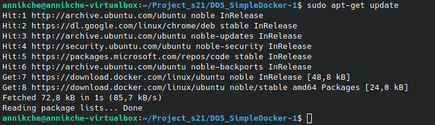

   Устанавливаем пакеты ca-certificates (для работы с SSL-сертификатами) и curl (для загрузки файлов по URL).
   
   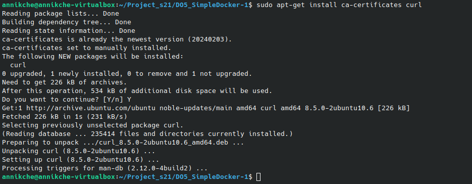
   
   Создаем директорию `/etc/apt/keyrings` с правами 0755 (владелец — чтение/запись/исполнение, остальные — чтение/исполнение) для хранения ключей репозиториев.
   
   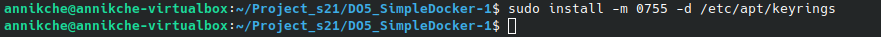

   Скачиваем GPG-ключ Docker и сохраняем его в `/etc/apt/keyrings/docker.asc`
   
   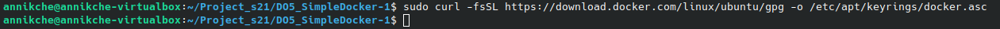

   Даём всем пользователям права на чтение (a+r) скачанного GPG-ключа.
   
   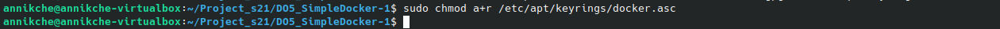

   Формируем строку с репозиторием Docker, подставляя текущую архитектуру системы и кодовое имя Ubuntu, затем сохраняем её в `/etc/apt/sources.list.d/docker.list`
   
   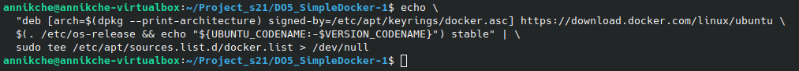

   - `arch=$(dpkg --print-architecture)` — автоматически определяет архитектуру (например, amd64).

   - `signed-by=/etc/apt/keyrings/docker.asc` — указывает путь к GPG-ключу для проверки подписи.

   - `/etc/os-release && echo "${UBUNTU_CODENAME:-$VERSION_CODENAME}"` — извлекает кодовое имя дистрибутива (например, jammy).

   - `tee > /dev/null` — записывает строку в файл, подавляя вывод в терминал.

   Обновляем список пакетов с учетом нового репозитория Docker.
   
   

   Установливаем пакеты Docker.
   
   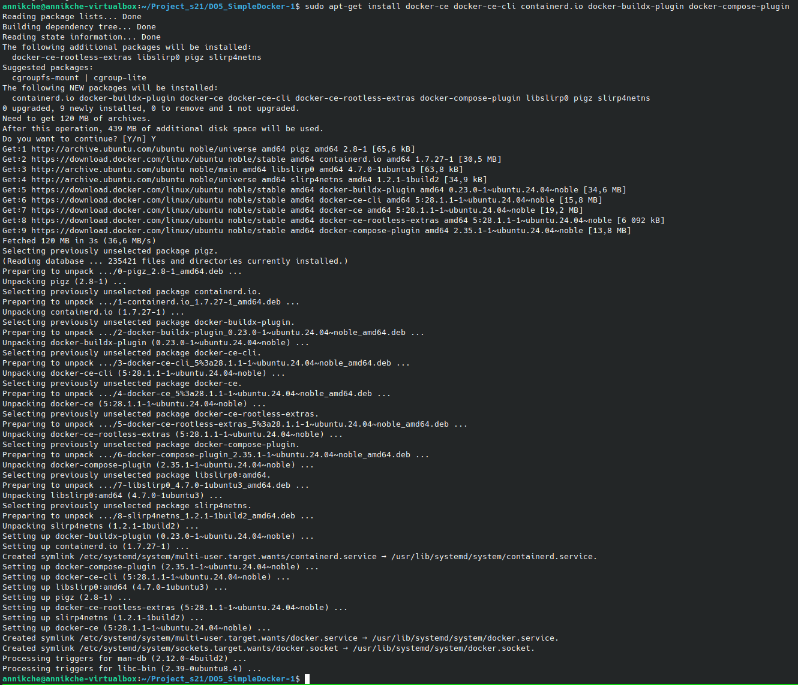

   Убеждаемся, что установка прошла успешно, запустив hello-world образ:
   
   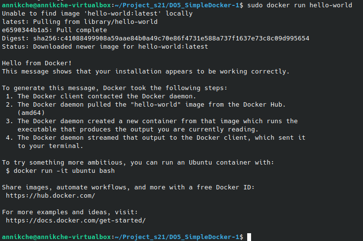

## Part 1. Готовый докер

Возьми официальный докер-образ с nginx и выкачай его при помощи docker pull.

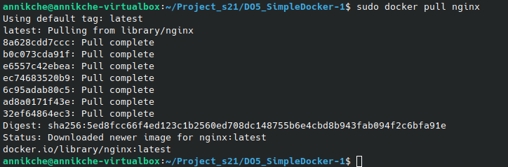

Запусти докер-образ через docker run -d [image_id|repository].

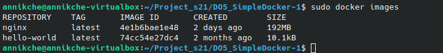

Проверь, что образ запустился через docker ps.

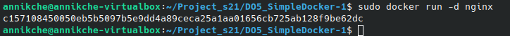

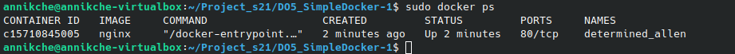

Посмотри информацию о контейнере через docker inspect [container_id|container_name].

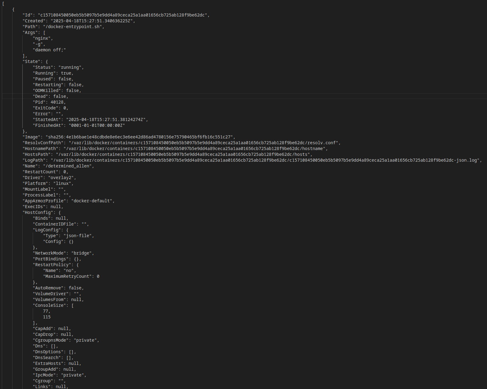

По выводу команды определи и помести в отчёт размер контейнера, список замапленных портов и ip контейнера.
   - размер контейнера
      
      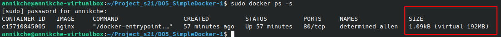
   
   - список замапленных порто

      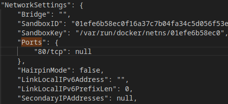

   - ip контейнера

      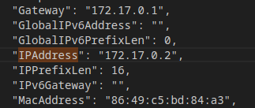

Останови докер контейнер через docker stop [container_id|container_name].

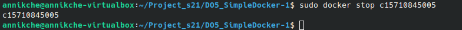

Проверь, что контейнер остановился через docker ps.

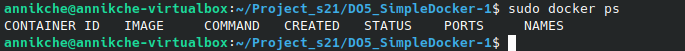

Запусти докер с портами 80 и 443 в контейнере, замапленными на такие же порты на локальной машине, через команду run.

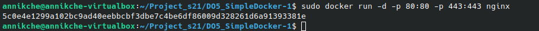

Проверь, что в браузере по адресу localhost:80 доступна стартовая страница nginx.

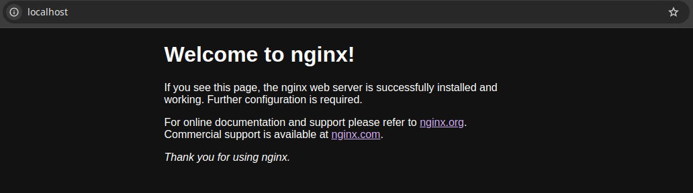

Перезапусти докер контейнер через docker restart [container_id|container_name].

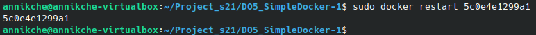

Проверь любым способом, что контейнер запустился.

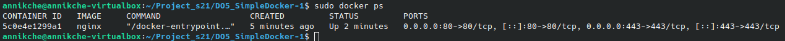

## Part 2. Операции с контейнером

Прочитаем конфигурационный файл nginx.conf внутри докер контейнера через команду exec.

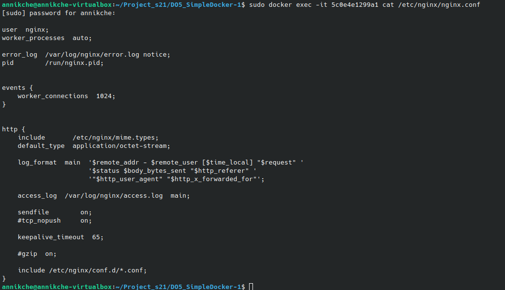

Создаем на локальной машине файл nginx.conf.

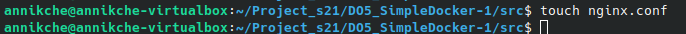

Настроем в нем по пути /status отдачу страницы статуса сервера nginx.

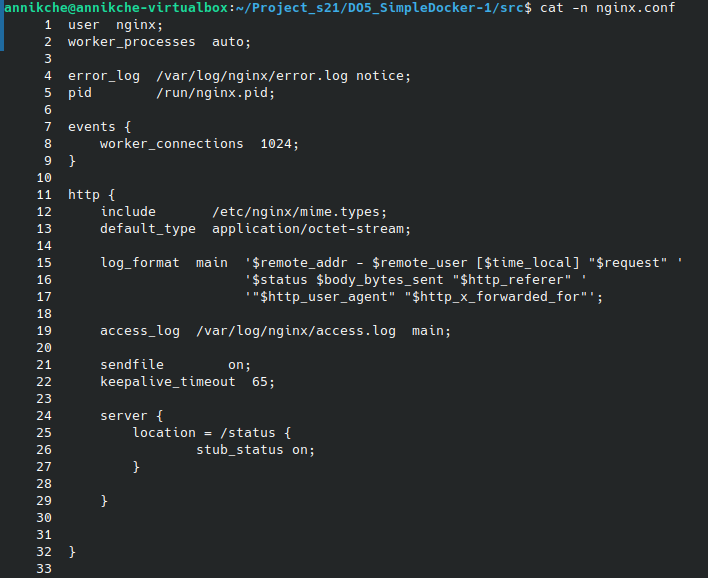

Скопируем созданный файл nginx.conf внутрь докер-образа через команду docker cp.

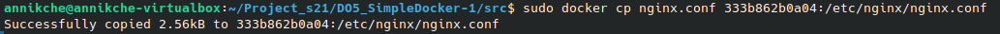

Перезапустим nginx внутри докер-образа через команду exec.

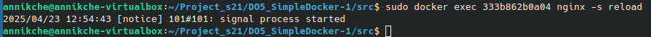

Проверим, что по адресу localhost:80/status отдается страничка со статусом сервера nginx.

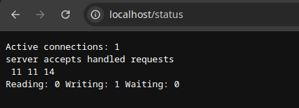

Экспортируем контейнер в файл container.tar через команду export.

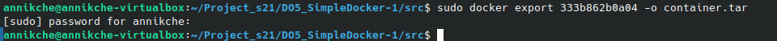

Останавливаем контейнер.

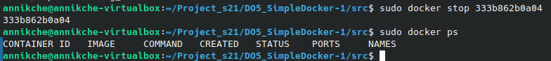

Удаляем остановленный контейнер.

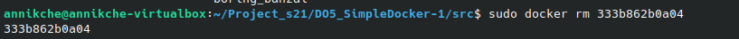

Импортируем контейнер обратно через команду import.

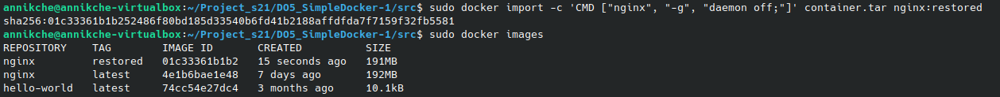

Запустим импортированный контейнер.

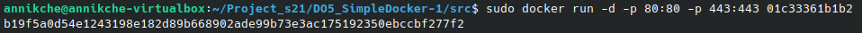

Проверяем, что по адресу localhost:80/status отдается страничка со статусом сервера nginx.

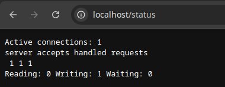

## Part 3. Мини веб-сервер

Напиши мини-сервер на C и FastCgi, который будет возвращать простейшую страничку с надписью Hello, World!.

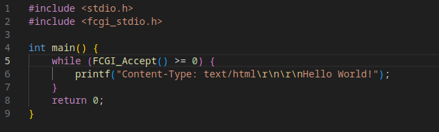

Запусти написанный мини-сервер через spawn-fcgi на порту 8080.

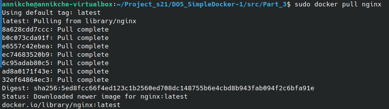

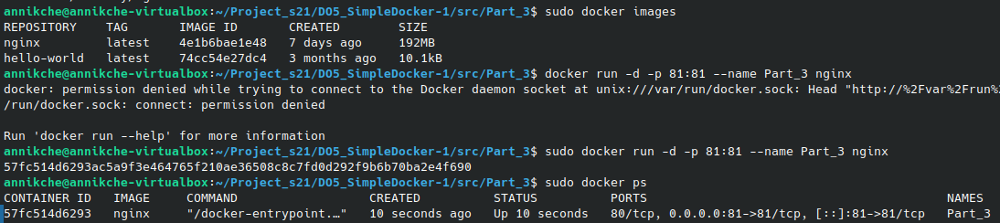

Напиши свой nginx.conf, который будет проксировать все запросы с 81 порта на 127.0.0.1:8080.

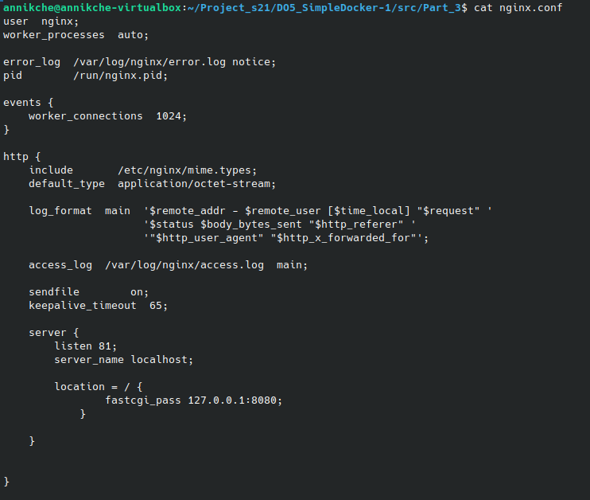

Запусти локально nginx с написанной конфигурацией.

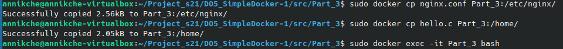
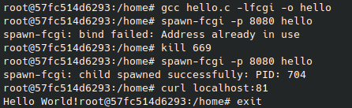

Проверь, что в браузере по localhost:81 отдается написанная тобой страничка.

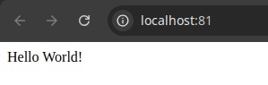

## Part 4. Свой докер

Напиши свой докер-образ, который:

1) собирает исходники мини сервера на FastCgi из Части 3;

2) запускает его на 8080 порту;

3) копирует внутрь образа написанный ./nginx/nginx.conf;

4) запускает nginx.

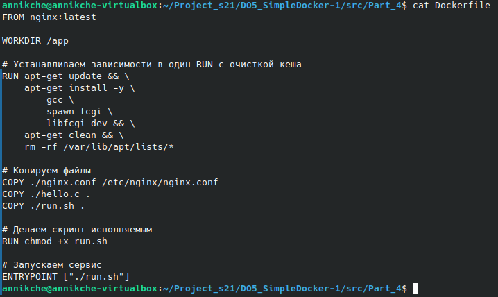

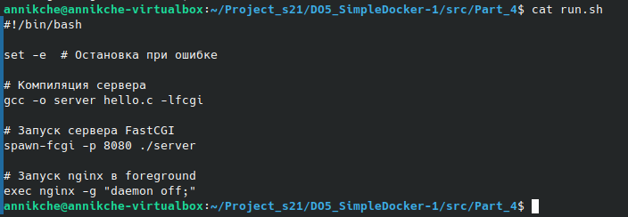

nginx можно установить внутрь докера самостоятельно, а можно воспользоваться готовым образом с nginx'ом, как базовым.

Собери написанный докер-образ через docker build при этом указав имя и тег.

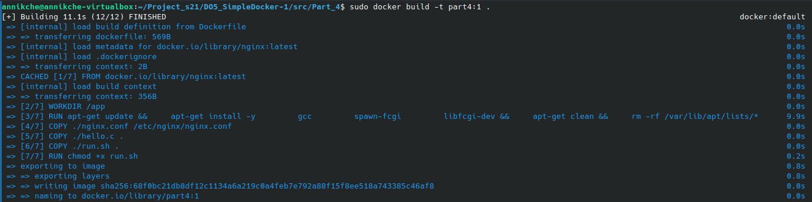

Проверь через docker images, что все собралось корректно.

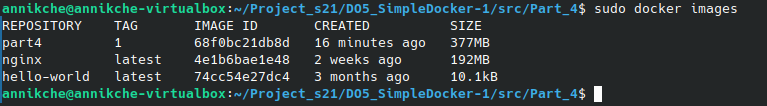

Запусти собранный докер-образ с маппингом 81 порта на 80 на локальной машине и маппингом папки ./nginx внутрь контейнера по адресу, где лежат конфигурационные файлы nginx'а (см. Часть 2).

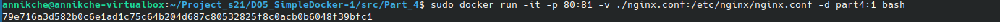

Проверь, что по localhost:80 доступна страничка написанного мини сервера.

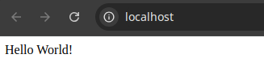

Допиши в ./nginx/nginx.conf проксирование странички /status, по которой надо отдавать статус сервера nginx.

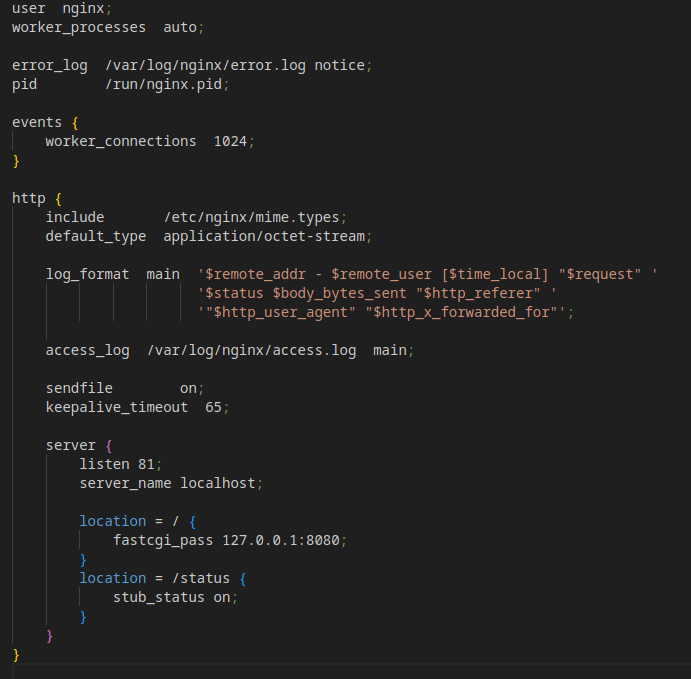

Пересобери докер-образ.
Если всё сделано верно, то, после сохранения файла и перезапуска контейнера, конфигурационный файл внутри докер-образа должен обновиться самостоятельно без лишних действий.

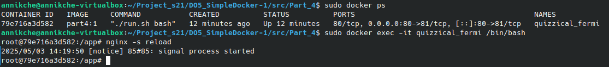

Проверь, что теперь по localhost:80/status отдается страничка со статусом nginx

## Part 5. Dockle

Просканируй образ из предыдущего задания через dockle [image_id|repository].

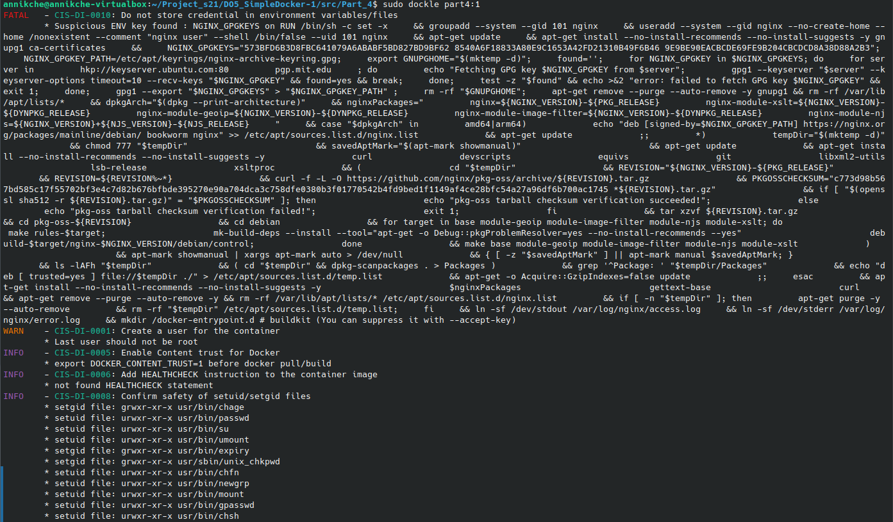

Исправь образ так, чтобы при проверке через dockle не было ошибок и предупреждений.

Повторно сканируем

## Part 6. Базовый Docker Compose

Напиши файл docker-compose.yml, с помощью которого:

1) Подними докер-контейнер из Части 5 (он должен работать в локальной сети, т. е. не нужно использовать инструкцию EXPOSE и мапить порты на локальную машину).

2) Подними докер-контейнер с nginx, который будет проксировать все запросы с 8080 порта на 81 порт первого контейнера.

Замапь 8080 порт второго контейнера на 80 порт локальной машины.

Cоздаем директорию server, где меняем настройки в файле nginx.conf:

Меняем настройки в Dockerfile server:

Создаем файл docker-compose.yml:

Останови все запущенные контейнеры.

Собери и запусти проект с помощью команд docker-compose build и docker-compose up.

Проверь, что в браузере по localhost:80 отдается написанная тобой страничка, как и ранее.

